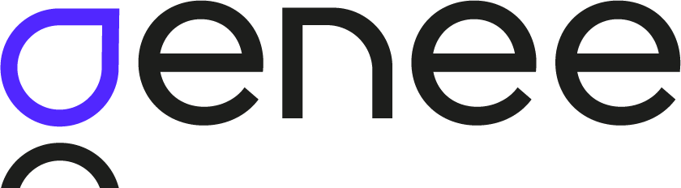

# Fullstack Developer Technical Test

## Context

This test is designed to evaluate not only your technical skills in web application development but also your ability to structure your code, address complex issues, and work in a team. The goal is not just to pass the test but to demonstrate your thought process, your work methodology, and your collaboration within a team.

## Technologies

- **Backend**: Python Flask.
- **Frontend**: Free choice.
- **Database**: Free choice.
- **Development Environment**: Free choice.

## Mission

Your task is to develop a web page integrating a dynamic form linked to a database. This database must include at least one entity "Case," and the form must allow creating or modifying a "Case" with the following elements:

1. **Case Name**: Field to enter the name.
2. **Location**: Dynamic selection field including:
   - Department
   - Municipality
   - Precision (free text field)

### Form Specifics:

- **Department/Municipality Relationship**: The choice of municipalities must be filtered based on the selected department, using the provided reference file (fr-esr-referentiel-geographique.csv).
- **Location Selection**:
  - **Single Mode**: Allows adding only one location.
  - **Multiple Mode**: Allows adding or removing locations dynamically.

### Pedagogical Objectives:

- **Code Structuring**: Your code should be well-organized, commented, and easy to understand.
- **Approach to the Problem**: We are interested in how you approach and solve the proposed challenges.
- **Teamwork**: Your ability to collaborate and contribute within a team is essential.

### Technical Constraints:

The form must be intuitive and ergonomic, with smooth transitions between location selection modes. The "Validate" button saves the data, which must be preloaded when the page is reloaded.

## Deliverables

We expect a clear and documented source code reflecting your ability to address complex problems and work collaboratively. Show us your thought process and work methodology through your code.

Your approach to tackling this challenge is as important to us as the final result. Good luck!
